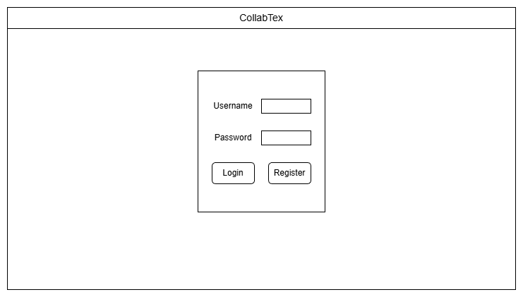
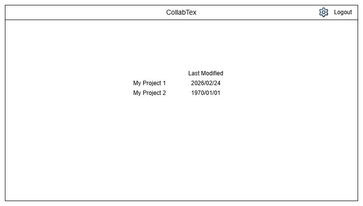
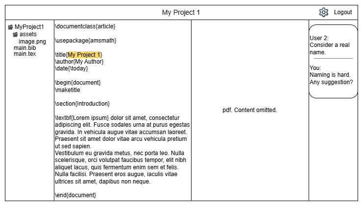

# Motivation

LaTeX is widely used in scientific publishing. Nearly all papers published in ACM and IEEE journals and conferences are
prepared using LaTeX. In addition, the University of Toronto provides an official LaTeX thesis template that is used by
most graduate students. Given the collaborative nature of research, academic papers are typically written by multiple
authors. Even theses, although authored by a single student, are significantly shaped by feedback and suggestions from
the student’s advisor.

Despite this clear need for collaboration, relatively few platforms and tools effectively support multiple contributors
working on the same LaTeX project. One commonly used platform is Overleaf. However, the community version imposes a
strict limit on compile time, making it unsuitable for large LaTeX projects. Advanced features such as version history,
which are essential for tracking changes, are restricted to the premium version. In addition, Overleaf lacks
fine-grained access control. All collaborators are granted the same write permissions, with no distinction between roles
such as administrator, editor, or commenter.

Another common approach is to store the source files in a shared Git repository on GitHub or GitLab. Although this
method offers robust version control, it requires all collaborators to install and maintain a local LaTeX toolchain. It
also does not support real-time collaborative editing, which can reduce efficiency and slow down teamwork. Furthermore,
Git handles large binary files poorly, making it less suitable for academic papers that often include a substantial
number of charts and images.

# Objective and Key Features

## Objective

The objective of this project is to design and implement a full-stack, collaborative web platform for LaTeX authoring.
The system enables multiple users to edit, manage, compile, and review LaTeX projects within a shared workspace in real
time.

Unlike traditional local LaTeX workflows, this platform centralizes project files, supports fine-grained collaboration
control, and provides live PDF preview with version tracking. The system is designed to be consistent under concurrent
edits, while maintaining low latency.

## Key Features

To achieve this objective, the platform implements the following core features:

### Real-Time Collaborative Editing

Multiple users can simultaneously edit the same LaTeX document and observe changes with minimal delay. The system
guarantees convergence: all collaborators will eventually see the same document state regardless of edit order.

**Technical approach:**
We use a Conflict-free Replicated Data Type (CRDT) model (Yjs) to ensure deterministic conflict resolution without
centralized locking. Updates are transmitted via WebSocket for low-latency bidirectional communication. The backend
maintains an in-memory CRDT instance per active document and periodically persists state to disk.

**Feasibility:**
CRDT-based synchronization avoids operational transformation complexity and ensures consistency under concurrent edits,
making it suitable for distributed collaborative environments.

### Role-Based Access Control (RBAC)

Each project enforces fine-grained permissions through predefined roles:

* **Admin:** Manage members and project settings.
* **Editor:** Modify and upload files.
* **Commenter:** Add and reply to comments.
* **Reader:** View-only access.

Users can only access projects to which they created or are shared with.

**Technical approach:**
A project-membership table maps users to roles. Middleware enforces authorization at both REST and WebSocket levels.
Permission validation occurs:

* On each REST request
* During WebSocket handshake
* On every document update event

**Feasibility:**
Centralized permission checks at the backend ensure consistent enforcement and prevent unauthorized operations, even if
frontend logic is bypassed.

### Secure Authentication

Users must register and authenticate before accessing any project resources.

**Technical approach:**

* Credentials (email + hashed password) are stored securely in the database.
* The backend issues a JWT upon login.
* All protected endpoints validate JWTs via middleware.
* Sessions persist across refreshes using secure cookies.

This approach provides stateless authentication and scalable session management.

### File Management and Project Structure

Each project supports hierarchical file organization, including:

* Creating, renaming, moving, and deleting files/folders
* Uploading assets (e.g., figures, binary files)

**Technical approach:**
The backend stores documents using absolute paths. Folder structure is logically derived from path prefixes (similar to
object storage systems such as S3). Name collisions are prevented via backend validation.

**Feasibility:**
Path-based storage simplifies implementation while supporting nested project organization without complex directory
schemas.

### Backend LaTeX Compilation with Live PDF Preview

Users can compile projects into PDF and view rendered output alongside the source editor. If compilation fails, error
logs are available for debugging.

**Technical approach:**

* Compilation jobs are scheduled and executed in containerized workers.
* Apache Airflow orchestrates build workflows.
* Build artifacts (PDF and logs) are cached in the filesystem.
* Build metadata is stored in the database.
* The frontend polls build status and updates the preview dynamically.

**Feasibility:**
Containerized builds isolate execution environments, ensuring safety and reproducibility. Asynchronous job orchestration
prevents blocking user interactions.

### Side-by-Side Editing and Preview

The workspace presents:

* A file tree (left panel)
* Source editor (center)
* Live PDF preview (right panel)
* Optional comment sidebar

This layout improves workflow efficiency by allowing users to edit and validate formatting simultaneously.

### Commenting System with Anchored Threads

Users can attach comment threads to specific text ranges within documents. Threads support:

* Replies
* Resolution
* Persistent anchors even when text shifts

**Technical approach:**
Comment threads store relative start and end indices. The frontend resolves anchors against the current CRDT state. If
anchor resolution fails (e.g., text deleted), the thread is marked as orphaned but remains accessible.

**Feasibility:**
Using relative indices ensures comments remain stable across document mutations, integrating cleanly with the CRDT
model.

### Versioning and Snapshot Management

The platform maintains periodic project snapshots to support:

* Viewing historical versions
* Diffing between versions
* Restoring previous states

**Technical approach:**

* Snapshots are periodically committed to disk.
* Metadata is recorded in the database.
* Restoring a version replaces the working state and triggers a `doc.reset` WebSocket event to resynchronize clients.

**Feasibility:**
Snapshot-based versioning provides reliable rollback without requiring full Git integration, balancing functionality and
implementation complexity.

## System Architecture Overview

The system follows a clear separation of concerns:

* **Frontend:** React + Vite + TypeScript
* **Backend:** Express.js + TypeScript (REST + WebSocket APIs)
* **Database:** Relational schema for users, projects, documents, builds, comments, and snapshots
* **File Storage:** Snapshots and build artifacts
* **Real-time Layer:** WebSocket + CRDT
* **Build Orchestration:** Containerized LaTeX compilation via Airflow

This modular architecture improves maintainability, scalability, and fault isolation.

## Database Schema

Below is the database schema.

### `users`

| column       | type          | constraints / notes    |
|--------------|---------------|------------------------|
| id           | UUID          | PK, generated UUID     |
| email        | VARCHAR(256)  | UNIQUE, NOT NULL       |
| name         | VARCHAR(256)  | NOT NULL               |
| passwordHash | VARCHAR(1024) | NOT NULL (salted hash) |
| createdAt    | TIMESTAMP     | NOT NULL               |
| updatedAt    | TIMESTAMP     | NOT NULL               |

### `projects`

| column      | type                 | constraints / notes |
|-------------|----------------------|---------------------|
| id          | UUID                 | PK, generated UUID  |
| name        | VARCHAR(256)         | NOT NULL            |
| createdAt   | TIMESTAMP            | NOT NULL            |
| updatedAt   | TIMESTAMP            | NOT NULL            |
| tombstoneAt | TIMESTAMP (nullable) | soft delete marker  |

### `project_memberships`

| column    | type                                        | constraints / notes        |
|-----------|---------------------------------------------|----------------------------|
| projectId | UUID                                        | FK → projects.id, NOT NULL |
| userId    | UUID                                        | FK → users.id, NOT NULL    |
| role      | ENUM('admin','editor','commenter','reader') | NOT NULL                   |
| createdAt | TIMESTAMP                                   | NOT NULL                   |

Constraints:

* `PRIMARY KEY (projectId, userId)`

### `documents`

Represents a file entry in the project tree (text or binary).

| column      | type                  | constraints / notes                                 |
|-------------|-----------------------|-----------------------------------------------------|
| id          | UUID                  | PK, generated UUID                                  |
| projectId   | UUID                  | FK → projects.id, NOT NULL                          |
| path        | VARCHAR(1024)         | NOT NULL (absolute within project)                  |
| kind        | ENUM('text','binary') | NOT NULL                                            |
| mime        | VARCHAR(256)          | nullable (useful for binary assets)                 |
| contentHash | VARCHAR(512)          | nullable for text (or computed), useful for caching |
| createdAt   | TIMESTAMP             | NOT NULL                                            |
| updatedAt   | TIMESTAMP             | NOT NULL                                            |

Constraints:

* `UNIQUE(projectId, path)`

### `snapshots`

A snapshot represents a committed project state stored externally (filesystem/object store).

| column      | type          | constraints / notes                              |
|-------------|---------------|--------------------------------------------------|
| id          | UUID          | PK, generated UUID                               |
| projectId   | UUID          | FK → projects.id, NOT NULL                       |
| storagePath | VARCHAR(1024) | NOT NULL                                         |
| message     | VARCHAR(512)  | nullable (optional commit msg)                   |
| authorId    | UUID          | FK → users.id, nullable (system commits allowed) |
| createdAt   | TIMESTAMP     | NOT NULL                                         |

### `comment_threads`

Anchors are stored as **encoded relative positions** (e.g., base64 Yjs RelativePosition).

| column      | type                    | constraints / notes                  |
|-------------|-------------------------|--------------------------------------|
| id          | UUID                    | PK, generated UUID                   |
| projectId   | UUID                    | FK → projects.id, NOT NULL           |
| documentId  | UUID                    | FK → documents.id, NOT NULL          |
| status      | ENUM('open','resolved') | NOT NULL                             |
| startAnchor | VARCHAR(1024)           | NOT NULL (encoded relative position) |
| endAnchor   | VARCHAR(1024)           | NOT NULL (encoded relative position) |
| createdAt   | TIMESTAMP               | NOT NULL                             |
| updatedAt   | TIMESTAMP               | NOT NULL                             |

### `comments`

| column    | type      | constraints / notes               |
|-----------|-----------|-----------------------------------|
| id        | UUID      | PK, generated UUID                |
| threadId  | UUID      | FK → comment_threads.id, NOT NULL |
| authorId  | UUID      | FK → users.id, NOT NULL           |
| body      | TEXT      | NOT NULL                          |
| createdAt | TIMESTAMP | NOT NULL                          |

Indexing:

* `INDEX(threadId, createdAt)`

### `builds`

| column       | type                                          | constraints / notes                   |
|--------------|-----------------------------------------------|---------------------------------------|
| id           | UUID                                          | PK, generated UUID                    |
| projectId    | UUID                                          | FK → projects.id, NOT NULL            |
| status       | ENUM('queued','running','succeeded','failed') | NOT NULL                              |
| createdAt    | TIMESTAMP                                     | NOT NULL                              |
| finishedAt   | TIMESTAMP (nullable)                          |                                       |
| pdfPath      | VARCHAR(1024) (nullable)                      | artifact path                         |
| logPath      | VARCHAR(1024)                                 | NOT NULL (even success may store log) |
| errorSummary | VARCHAR(1024) (nullable)                      | quick UI display                      |

## Backend API

Two interfaces are exposed:

* **REST** for standard operations (`/api/...`)
* **WebSocket** for real-time collaboration and synchronization (`/ws`)

### REST API

#### Auth

| Endpoint             | Method | Auth | Request                 | Response                      | Notes                              |
|----------------------|--------|------|-------------------------|-------------------------------|------------------------------------|
| `/api/auth/register` | POST   | No   | `email, password, name` | `user{id,email,name}` + `jwt` | 409 if email exists                |
| `/api/auth/login`    | POST   | No   | `email, password`       | `user{...}` + `jwt`           | 401 on bad creds                   |
| `/api/auth/logout`   | POST   | Yes  | —                       | 204                           | clears cookie if using cookie auth |
| `/api/me`            | GET    | Yes  | —                       | `user{id,email,name}`         | —                                  |

#### Projects

| Endpoint                   | Method | Role            | Request | Response                                       | Notes                   |
|----------------------------|--------|-----------------|---------|------------------------------------------------|-------------------------|
| `/api/projects`            | POST   | any authed user | `name`  | `project{id,name,createdAt}`                   | creator becomes `admin` |
| `/api/projects`            | GET    | any authed user | —       | `projects[{id,name,myRole,updatedAt}]`         | only member projects    |
| `/api/projects/:projectId` | GET    | member          | —       | `project{id,name,createdAt,updatedAt}, myRole` | 404 if not member       |
| `/api/projects/:projectId` | PATCH  | admin           | `name`  | `project{...}`                                 | rename                  |
| `/api/projects/:projectId` | DELETE | admin           | —       | 204                                            | set `tombstoneAt`       |

#### Members (RBAC)

| Endpoint                                   | Method | Role          | Request       | Response                            | Notes                               |
|--------------------------------------------|--------|---------------|---------------|-------------------------------------|-------------------------------------|
| `/api/projects/:projectId/members`         | GET    | member        | —             | `members[{userId,email,name,role}]` | —                                   |
| `/api/projects/:projectId/members`         | POST   | admin         | `email, role` | `member{userId,role}`               | user must exist                     |
| `/api/projects/:projectId/members/:userId` | PATCH  | admin         | `role`        | `member{userId,role}`               | —                                   |
| `/api/projects/:projectId/members/:userId` | DELETE | admin or self | —             | 204                                 | self-leave disallowed if last admin |

#### Files / Documents

| Endpoint                        | Method | Role         | Request             | Response                      | Notes                          |
|---------------------------------|--------|--------------|---------------------|-------------------------------|--------------------------------|
| `/api/projects/:projectId/docs` | POST   | editor+admin | `path, kind, mime?` | `document{id,path,kind,mime}` | create new document entry      |
| `/api/projects/:projectId/docs` | PATCH  | editor+admin | `[{docId,newPath}]` | 204                           | rename/move; checks collisions |
| `/api/projects/:projectId/docs` | DELETE | editor+admin | `[docId]`           | 204                           | delete docs                    |

#### Comments

| Endpoint                                           | Method | Role       | Request                                       | Response                                                           |
|----------------------------------------------------|--------|------------|-----------------------------------------------|--------------------------------------------------------------------|
| `/api/projects/:projectId/docs/:docId/comments`    | GET    | member     | —                                             | `threads[{id,status,startAnchor,endAnchor,quotedText,comments[]}]` |
| `/api/projects/:projectId/docs/:docId/comments`    | POST   | commenter+ | `startAnchorB64,endAnchorB64,quotedText,body` | `thread{...}, comment{...}`                                        |
| `/api/projects/:projectId/threads/:threadId/reply` | POST   | commenter+ | `body`                                        | `comment{...}`                                                     |

#### Versioning (Snapshots)

| Endpoint                                                 | Method | Role         | Request | Response                                      | Notes                     |
|----------------------------------------------------------|--------|--------------|---------|-----------------------------------------------|---------------------------|
| `/api/projects/:projectId/snapshots`                     | GET    | member       | —       | `snapshots[{id,message,authorId?,createdAt}]` | list history              |
| `/api/projects/:projectId/snapshots/:snapshotId`         | GET    | member       | —       | `snapshot files / manifest`                   | retrieve snapshot content |
| `/api/projects/:projectId/snapshots/:snapshotId/restore` | POST   | editor+admin | —       | `{restoredSnapshotId}`                        | broadcasts `doc.reset`    |

#### Build / Compile (PDF)

| Endpoint                                       | Method | Role   | Response                                              | Notes            |
|------------------------------------------------|--------|--------|-------------------------------------------------------|------------------|
| `/api/projects/:projectId/builds/:buildId`     | GET    | member | `build{id,status,finishedAt?,errorSummary?,pdfReady}` | FE polls         |
| `/api/projects/:projectId/builds/:buildId/pdf` | GET    | member | `application/pdf` stream                              | 404 if not ready |
| `/api/projects/:projectId/builds/:buildId/log` | GET    | member | `text/plain` stream (or `{log}`)                      | show on failure  |

### WebSocket API

Connection:
`ws://host/ws?projectId=...&docId=...`
Authentication: JWT (cookie or header during upgrade)

Message types:

| Type                | Dir | Role         | Payload                | Purpose                        |
|---------------------|-----|--------------|------------------------|--------------------------------|
| `doc.sync.request`  | C→S | member       | `{docId}`              | request full state             |
| `doc.sync.response` | S→C | member       | `{docId,stateB64}`     | send full CRDT state           |
| `doc.update`        | C→S | editor+admin | `{docId,updateB64}`    | apply & broadcast update       |
| `doc.update`        | S→C | member       | `{docId,updateB64}`    | incremental updates            |
| `presence.update`   | C→S | member       | `{docId,awarenessB64}` | cursor/selection presence      |
| `presence.update`   | S→C | member       | `{docId,awarenessB64}` | broadcast presence             |
| `doc.reset`         | S→C | member       | `{docId,reason}`       | after restore; clients re-sync |
| `error`             | S→C | member       | `{code,message}`       | validation/permission errors   |

## UI Summary

The UI consists of three pages:

1. **Login / Register:** account creation and authentication.
   
2. **Project List:** displays projects the user belongs to; supports project creation.
   
3. **Workspace:** file tree (left), source editor (center), PDF preview (right), plus an optional comment sidebar.
   

## Summary

This project delivers a fully functional collaborative LaTeX platform that integrates:

* Real-time CRDT-based editing
* Secure authentication and RBAC
* Structured file management
* Backend PDF compilation
* Anchored commenting
* Snapshot-based version control

Each feature is backed by a concrete technical implementation that ensures practical feasibility within the project
scope.

# Tentative Plan

## Overview

**Start Date:** March 2
**Duration:** 4 weeks

**Team**

* Ciliang Zhang — Frontend
* Sitao Wang — Backend

## Project Objectives

Over the next few weeks, the team will deliver:

* Realtime collaborative LaTeX editing
* Comment threads anchored to text
* Project-level versioning (commit + restore)
* LaTeX compile with PDF preview (by end of Week 3)
* Final week dedicated to stabilization and polish

The implementation approach is incremental:

1. Establish core data models and structure.
2. Add realtime collaboration.
3. Add versioning and compile system.
4. Stabilize and polish for demo readiness.

## Responsibility Breakdown

### Frontend

Responsible for:

* All UI implementation
* Editor integration
* WebSocket client integration
* Rendering file tree and comments
* Version history UI
* PDF preview UI
* Role-based UI restrictions
* Styling and polish

### Backend

Responsible for:

* Database schema (Prisma + Postgres)
* REST APIs
* Role-based access control
* WebSocket server and Yjs document management
* Snapshot versioning system
* Comment data model and APIs
* LaTeX compile system (Docker + Airflow)
* Workspace export logic
* Backend testing

## Week 1 — Core Structure and Workspace

### Objective

Build the foundational system:

* Authentication
* Projects and membership
* File tree management
* Basic workspace UI
* File opens in editor (non-realtime)

### Backend Focus

* Finalize database schema:

    * Users
    * Projects
    * Memberships
    * File tree (Node model)
    * Documents
    * Snapshot model
* Implement:

    * Auth endpoints
    * Project CRUD
    * Membership management
    * File tree CRUD
* Implement basic WebSocket connection structure
* Implement document snapshot loading

### Frontend Focus

* Build login and project list pages
* Implement 3-column workspace layout
* Render file tree
* Create file/folder modals
* Integrate editor library
* Load document content via REST
* Implement basic role-based UI gating

### End of Week 1 Outcome

* Users can log in
* Projects can be created
* Files and folders can be managed
* Files open in editor
* System structure is stable

## Week 2 — Realtime Collaboration and Comments

### Objective

Enable collaborative editing and comments.
Confirm compile environment works.

### Backend Focus

* Integrate Yjs for realtime editing
* Maintain in-memory document instances
* Implement `doc.update` WebSocket handling
* Broadcast updates to connected clients
* Implement snapshot persistence
* Enforce role restrictions in WebSocket layer
* Implement comment models:

    * Thread
    * Anchor (relative positions)
    * Messages
* Implement comment REST endpoints
* Set up Docker LaTeX proof-of-concept compile
* Confirm logs and timeout handling

### Frontend Focus

* Bind editor library to Yjs
* Implement WebSocket client logic
* Handle sync, update, reconnect states
* Add read-only mode for commenter role
* Implement comments panel:

    * Create thread from selection
    * Reply
    * Resolve
    * Scroll-to-anchor behavior
* Display connection state indicator

## End of Week 2 Outcome

* Two users can edit the same document in realtime
* Comments attach to text selections
* Snapshot persistence works
* Docker LaTeX compile works in isolation

## Week 3 — Versioning and Full Compile System

### Objective

Complete versioning and fully integrate compile + PDF preview.

### Backend Focus

* Implement versioning system:

    * Snapshot all documents
    * Store version metadata
    * Restore version logic
    * Broadcast reset to clients
* Implement build system:

    * Build model
    * Queue logic (one build per project)
    * Workspace export to filesystem
* Integrate Docker LaTeX compile for real project files
* Implement:

    * Build status endpoint
    * PDF streaming endpoint
    * Log retrieval endpoint
* Add support for selecting main document

### Frontend Focus

* Implement History tab:

    * Create version
    * List version
    * Restore confirmation
* Implement PDF tab:

    * Compile button
    * Poll build status
    * Display PDF preview
    * Show logs on failure
* Finalize role gating for compile and restore
* Clean up UI consistency

### End of Week 3 Outcome

* Full demo working:

    * Realtime editing
    * Comments
    * Version creation and restore
    * Compile and PDF preview

## Week 4 — Stabilization and Polish

### Objective

Improve reliability and presentation quality.

### Backend Focus

* Improve error handling
* Improve build timeout and error summaries
* Add WebSocket payload limits
* Finalize folder delete behavior
* Conduct basic smoke tests

### Frontend Focus

* Styling consistency pass
* Improve empty states
* Improve disabled states
* Minor UX refinements
* Fix bugs discovered during integration

### End of Week 4 Outcome

* Stable system suitable for demonstration
* Clean and consistent UI
* Reduced risk of runtime failures

## Summary

The team will:

1. Build vertical slices in stages (structure → realtime → versioning → compile).
2. Integrate high-risk components early (Docker compile in Week 2).
3. Keep infrastructure simple (single-node, snapshot persistence).
4. Allocate the final week entirely to stabilization rather than new features.

This phased approach ensures that core functionality is complete by Week 3, leaving Week 4 dedicated to reliability and
polish.

# Initial Independent Reasoning

AI does not take part in the planing process. It is only used to help write the proposal after the plan is finalized.

## Application structure and architecture

We chose a separate frontend backend architecture rather than a full-stack framework (e.g., Next.js) because our system
needs both REST endpoints (projects, files, history, builds) and persistent WebSocket connections (real-time
editing, presence, and reset events). Keeping WebSocket state, authorization, and rate/resource controls in a dedicated
backend service is simpler to reason about and test.

This split also matches our team’s skills: we can iterate quickly on the UI in React/Vite, while the backend focuses on
Express, real-time synchronization, and build orchestration without coupling deployment concerns to frontend rendering.

## Data and state design

We planned the data model around three layers of state, each with different consistency and performance needs:

* **Persistent metadata (PostgreSQL + Prisma):**
  User accounts, projects, memberships/roles, document metadata (paths, types), builds, snapshots, and comment threads
  live in a relational database. A relational schema fits naturally because the project has clear entities (
  users/projects/docs) and many-to-many relationships (memberships), and Prisma helps us evolve the schema safely.

* **File and artifact storage (filesystem initially, object storage-ready):**
  The actual project contents (LaTeX sources and binary assets) and build outputs (PDF + logs) are stored outside the
  database. We plan to start with the local filesystem for simplicity and faster development, but we keep the
  interface abstract so we can later migrate to cloud object storage like S3 without changing core logic.

* **Real-time collaborative state (in-memory CRDT with persistence):**
  For active documents, the server maintains an in-memory **Yjs CRDT** instance to support low-latency collaboration
  over WebSockets. The CRDT state is periodically persisted (and/or persisted on close) so the system remains durable
  and supports version history. Clients can request a full sync on reconnect and then apply incremental updates.

**CRDT vs. OT decision:**
We compared OT (e.g., ShareDB) and CRDT (e.g., Yjs).

Both approaches are proven in production collaborative editors. OT are used by traditional platforms like Google Docs
and Overleaf, while CRDTs are used by newer platforms like Figma and Notion. CRDT needs more memory to keep relative
indexing metadata, but provides scalability and offline editing. However, this project does not target scalability,
and we don't need offline editing.

Despite the overhead of CRDT, we find it a better fit for our anchored commenting requirement. CRDT supports relative
positions that remain stable as concurrent edits occur, which makes it easier to keep comment anchors attached to the
intended text. With OT, anchors are typically absolute offsets, which would require additional bookkeeping to update
comment ranges on every transformation, adding more complexity.

## Feature selection and scope decisions

We scoped features by separating core functionality from advanced functionality:

Core features includes the fundamental functionalities required for a collaborative LaTeX editor.

* Authentication + project membership
* RBAC enforcement across REST and WebSocket
* File tree and basic project file operations
* Real-time collaborative editing (single document working well first)
* Server-side LaTeX build with PDF preview + logs

Advanced features are important but not strictly necessary.

* Anchored comment threads that survive edits and deletions
* Snapshot-based versioning with restore
* Presence indicators and richer collaboration UI

**Tradeoffs we considered:**
We intentionally avoided overly ambitious features, such as:

- Detailed versioning that tracks changes for different files and users.
- Integrating AI assistance for writing LaTeX.

We focus on correctness and reliability in real-time editing and build system, rather than adding more features that
could introduce instability or require significant additional development time.

## Anticipated challenges

Before implementation, we expected the hardest parts to be:

* **Real-time synchronization and convergence:**
  Even with Yjs, we still need robust WebSocket lifecycle handling (reconnects, resync, ordering, backpressure) and
  careful state maintaining.

* **Secure and reliable LaTeX compilation:**
  Compiling arbitrary LaTeX requires isolation, resource limits, and good failure reporting. We planned containerized
  builds (e.g., Docker workers) with explicit time/memory limits, plus clear log capture so users can debug failed
  builds without guessing.

* **Comment anchoring under edits:**
  Maintaining stable anchors while text shifts is tricky. We expected this to be challenging even with CRDT
  relative positions, especially for edge cases like deleted or heavily edited regions.

## Early collaboration plan

We planned to divide work along architectural boundaries to reduce merge conflicts and unblock parallel progress:

* **Frontend track:** authentication UI, project list/workspace layout, file tree, editor + preview, and comment
  sidebar.
* **Backend track:** auth/RBAC middleware, REST API, WebSocket protocol, CRDT persistence, and build pipeline endpoints.
* **Shared contracts:** early agreement on API payloads and WebSocket message types to prevent integration drift.

To coordinate, we planned short, frequent syncs focused on interface alignment (schemas, endpoints, event types) rather
than detailed schedules. We used GitHub with feature branches and pull requests, required reviews all changes, and set
up CI for build/lint checks on each PR to keep integration stable as multiple features landed in parallel.

# AI Assistance Disclosure

As stated in the previous section, AI was not involved in the planning process. However, we use AI assistance to help
improve the writing quality of the proposal. All parts of the proposal, except this part, were first written by team
members and then refined with the help of AI. We use AI to enhance clarity and grammar, but all design decisions,
architectural choices and technical details are the original work of the team. We have reviewed all AI-generated
content to ensure it accurately reflects our intentions.

For example, the motivation section originally written by us was:
> Latex is widely used in scientific publication. All papers published in ACM and IEEE journals and conferences are
> composed using Latex. Furthermore, University of Toronto provides a Latex template, from which most theses are
> written. Given the collaborative nature of research, most papers are written by multiple authors, and theses, although
> produced by one person, are often guided by suggestions and comments from the advisor.

> Despite the need for multiple authors and commenters to work on the same Latex project together, there are not a
> lot of platforms and tools that support the collaboration. A common platform available is Overleaf. However, the
> community version has a strict limit on the compile time, and is not suitable for a large Latex project. Advanced
> features like versioning, which is very useful, are also locked in the premium version. For collaboration, it lacks
> more fine-grained access control. All collaborators have the same write access. There is no support for admin and
> commenter.

> Another widely used way to collaborate on Latex is to use shared git repo on GitHub or GitLab to store the source
> files. All collaborators need to install Latex toolchain locally, and there is no support for real-time collaboration.
> Git is also not designed for handling large binary files, which can be a problem for Latex projects with many figures.

We ask the AI to help use improve the writing quality, and it produces the following version:

> LaTeX is widely used in scientific publishing. Virtually all papers published in ACM and IEEE journals and conferences
> are prepared using LaTeX. In addition, the University of Toronto provides an official LaTeX thesis template, which is
> used by most graduate students. Given the collaborative nature of research, academic papers are typically written by
> multiple authors. Even theses, although authored by a single student, are shaped extensively by feedback and
> suggestions from advisors.

> Despite this strong need for collaboration, there are relatively few platforms and tools that effectively support
> multiple contributors working on the same LaTeX project. One commonly used platform is Overleaf. However, the
> community version imposes strict compile-time limits, making it unsuitable for large LaTeX projects. Advanced features
> such as version history—an essential tool for tracking changes—are restricted to the premium version. In terms of
> collaboration controls, Overleaf also lacks fine-grained access management: all collaborators are granted the same
> write permissions, with no distinction between roles such as administrator, editor, or commenter.

> Another widely used approach is to host the source files in a shared Git repository on GitHub or GitLab. While this
> method provides version control, it requires all collaborators to install and maintain a local LaTeX toolchain.
> Moreover, it does not support real-time collaborative editing, which can hinder efficient teamwork.

The AI-refined version is clearer and more polished, but it omits some important details, such as Git lacking good
support for large binary files. We keep iterating with the AI until we get a version that is both clear and complete,
which is the one presented in the proposal.
